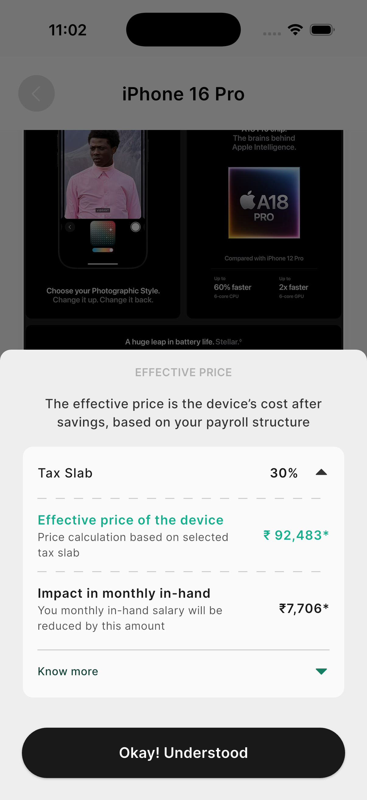

# Tortoise Assignment

## Run & Build APK

```sh
flutter pub get
flutter run
# To build release APK:
flutter build apk --release --flavor prod -t lib/main_prod.dart
```


## Screenshots

Screenshots are in the `screenshots/` folder in the root of the repository (not in assets/images, to avoid increasing APK size):

**Home Page**


**Product Details Page**




## Download APK

[Download latest release APK](https://github.com/TusharSharmaIN/tortoise_assignment/releases) <!-- Update this link if repo changes -->

## Features

- **Home Page**
	- Search and catalogue
		- Input search
		- Pick from popular
		- Pick product from selected brands
- **Product Details Page**
	- Product images
	- Pick desired color
	- Pick storage options
	- Check full specifications
	- Image banner
- **Effective Price BottomSheet**
	- Show effective price according to tax slab
